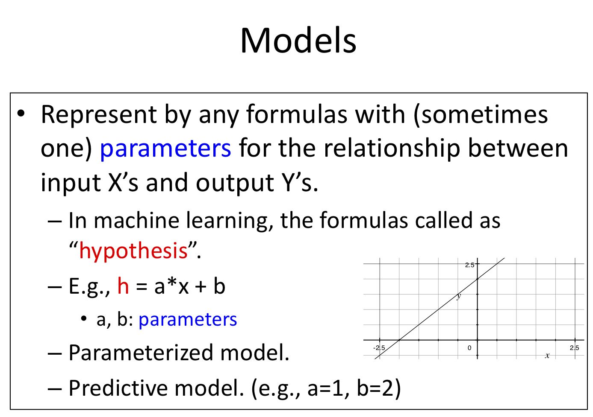
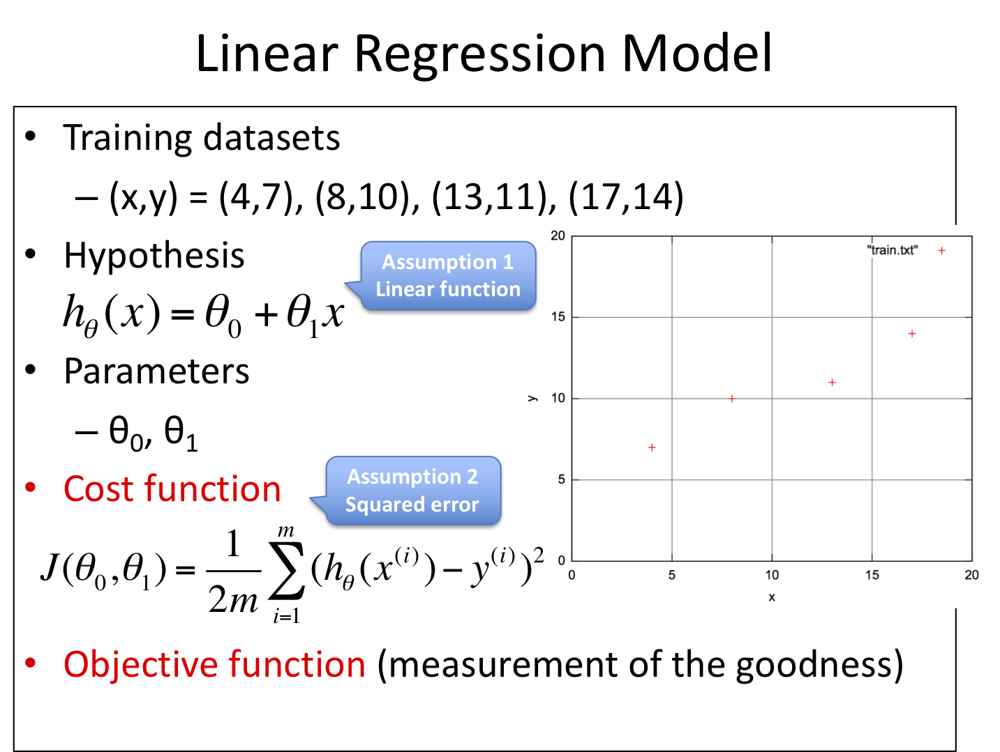
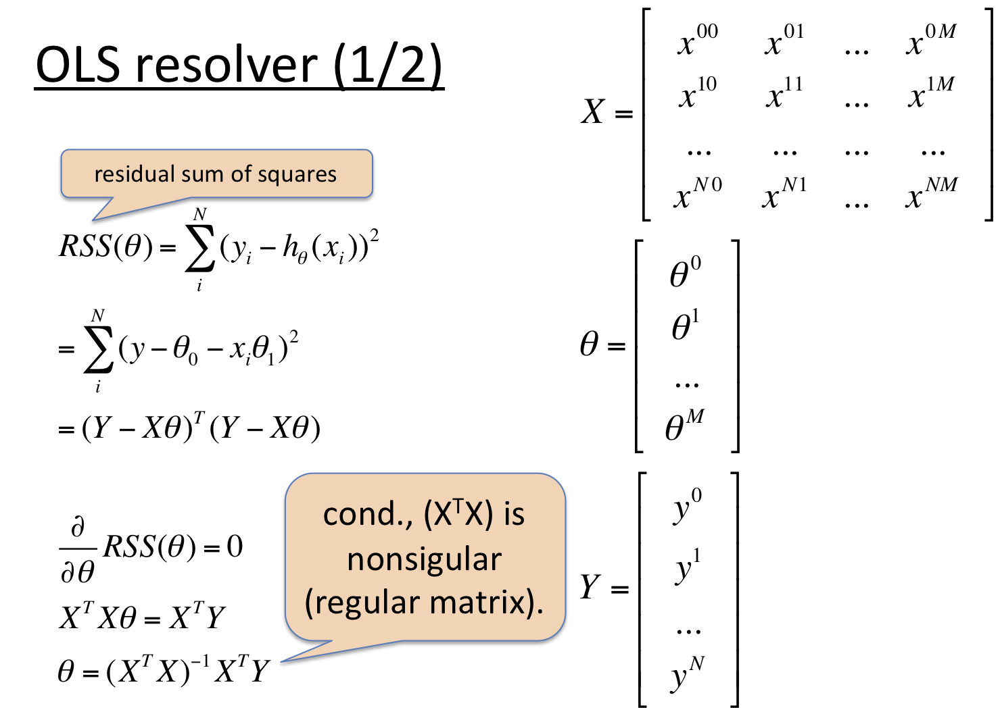
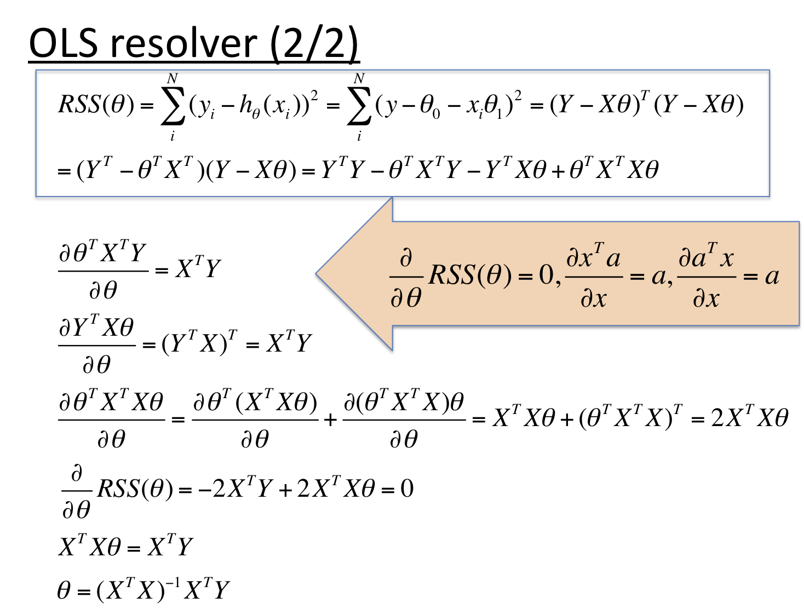
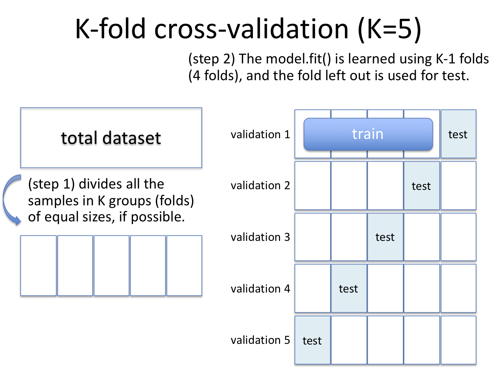

# 機械学習外観

- ＜目次＞
  - <a href="#goal">達成目標</a>
  - <a href="#definition">定義</a>
  - <a href="#settings">問題設定</a>
    - <a href="#ex1">演習1：問題検討</a>
    - <a href="#ex2">演習2：教師あり学習における処理フローの確認</a>
  - <a href="#flow-and-datasets">教師あり学習における処理フローの例、公開データの例</a>
  - <a href="#report1">**課題レポート1：機械学習してみよう**</a>
  - <a href="#preparation">予習代わり：課題取り組みを通した疑問等</a>
  - <a href="#model-and-learn">モデルと学習</a>
  - <a href="#complexity-and-overfitting">モデルの自由度（複雑度）と過学習</a>
  - <a href="#overfitting-monitoring">そもそも「過学習しているか否か」はどう判断したら良い？</a>
  - <a href="#prevent">過学習させない方法、もしくは和らげる工夫はないのだろうか？</a>
  - <a href="#review">復習</a>

## <a name="goal">達成目標</a>
- 以下の用語について説明できるようになる。
  - 仮説、モデル、入出力、特徴ベクトル、特徴量、データセット
- コード例を元に、教師あり学習のイメージを掴む。
- 過学習とは何か、この状況に陥ったモデルが何故悪いのかを説明できる。

## <a name="definition">定義</a>
- Arthur Samuel (1959), ["Some Studies in Machine Learning Using the Game of Checkers"](http://citeseerx.ist.psu.edu/viewdoc/download?doi=10.1.1.368.2254&rep=rep1&type=pdf)
  - "a computer can be programmed so that it will learn to play a better game of checkers than can be played by the person who wrote the program."
  - 人手で書いたプログラムよりも、うまくプレイできるように学ぶことができるようにプログラムされたコンピュータのこと。
- Tom Mitchell, ["The Discipline of Machine Learning"](http://www.cs.cmu.edu/~tom/pubs/MachineLearning.pdf)
  -  "we say that a machine learns with respect to a particular task T, performance metric P, and type of experience E, if the system reliably improves its performance P at task T, following experience E."
  - ある特定のタスクT、パフォーマンス評価指標となるP、得られた経験Eに基づいて学習することで、そのパフォーマンスを改善しうるシステムのことを機械学習と呼ぶ。

## <a name="settings">問題設定</a>
- [Machine Leaning: the problem setting](http://scikit-learn.org/stable/tutorial/basic/tutorial.html)
  - In general, a learning problem considers a set of n samples of data and then tries to predict properties of unknown data. If each sample is more than a single number and, for instance, a multi-dimensional entry (aka multivariate data), is it said to have several **attributes** or **features**.
  - n個のサンプルからなるデータセットを用意し、未知データの特性を予測しようと試みる。もし、各サンプルが2個以上の数値で構成されているなら、そのサンプルを多次元データ（＝ベクトル）と呼ぶ。この場合、各ベクトルを構成する個々の要素を**属性**、もしくは**特徴**と呼ぶ。
    - 一般には、そもそも単一特徴であることはほぼ無い。ただし、アルゴリズムの理解を促すため等、特定条件下においては単一特徴からなるサンプル、すなわちスカラーを用いることがある。
- 機械学習の種類、体系化の例
  - [Business Intelligence and its relationship with the Big Data, Data Analytics and Data Science](https://www.linkedin.com/pulse/business-intelligence-its-relationship-big-data-geekstyle/)
  - [Choosing the right estimator](https://scikit-learn.org/stable/tutorial/machine_learning_map/index.html)
  - 教師あり学習
    - 分類
      - In Classification, the samples belong to two or more classes and we want to learn from already labeled data how to predict the class of unlabeled data.
      - モデルの出力がカテゴリ値（数値ではない）
    - 回帰
      - If the desired output consists of one or more continuous variables, then the task is called regression.
      - モデルの出力が連続値
  - 教師なし学習
    - クラスタリング
      - Clustering is the task of grouping a set of objects in such a way that objects in the same group (called a cluster) are more similar (in some sense or another) to each other than to those in other groups (clusters).
      - 類似したものをグループにまとめる
    - 次元削減
      - PCA is used to decompose a multivariate dataset in a set of successive orthogonal components that explain a maximum amount of the variance.
      - 分散の最大量を説明しやすい、直行成分上の空間に圧縮するために使われる。
  - 強化学習
    - Reinforcement learning (RL) is an area of machine learning concerned with how software agents ought to take actions in an environment so as to maximize some notion of cumulative reward.
    - 累積報酬最大化のために取るべき行動を獲得するための手法。

### <a name="ex1">演習1：問題検討</a>
- 回帰タスクの一例を検討してみよう。

### <a name="ex2">演習2：教師あり学習における処理フローの確認</a>
- 回帰タスクのコード例を動かして、教師あり学習における処理フローを眺めてみよう。
- GitHub:
  - regression_diabetes.ipynb
  - requirements
    - Python: 3.7.1
    - scikit-learn: 0.20.1
    - numpy: 1.15.4
    - matplotlib: 3.0.2
    - jupyter
  - Diabetes dataset
    - 442サンプル
      - 10個の標準化した特徴量
        - 年齢、性別、ボディマス指数、平均血圧、6つの血清測定結果
      - ベースラインからの、1年後における糖尿病進行度合い
    - 本データセットの目的
      - 10個の測定結果から、1年後の進行度合いに関する実データを442サンプル得た。これをベースに、未知のサンプルに対して1年後の進行度合いを予測したい。
- 確認項目
  - Diabetesデータセットにおける各サンプルは、何次元のベクトルだろうか？
  - 各ベクトルは何個の特徴量で構成されているだろうか？
  - サンプルと教師データはどのように用意されているだろうか？
  - モデルはどう用意しているだろうか？
  - 用意したデータセットとモデルを使って、どのように学習しているだろうか？
  - 学習済みモデルの評価をどのようにしているだろうか？
  - 学習済みモデルは、学習した結果何を得ているのだろうか？

## <a name="flow-and-datasets">教師あり学習における処理フローの例、公開データの例</a>
- 処理フローの例
  - タスク種別を設定し、評価方法を検討する。
  - データを用意する。
    - 機械学習について学ぶことが主目的なら、[公開データの例](https://docs.google.com/document/d/e/2PACX-1vRgMcscQFuB-rRgmpoqc4oZAa3rZdzoy0cNcOfm58AUJ1kG9fkhl9egCfPYvjCcR3voF8pzvvH4eXH_/pub)や、Kaggle等コンペティションで提供されているデータセットを選択するのが楽。
  - モデルを用意する。
  - 学習する。
  - 学習済みモデルを評価する。
  - 必要に応じて、データ・モデル・ハイパーパラメータ等をチューニングしながら改善を目指す。
  - 目標性能に達したのであれば、（これまで人手でやっていたことを）学習済みモデルに置き換える。

## <a name="report1">**課題レポート1：機械学習してみよう**</a>
- [Machine Learning Repository](https://archive.ics.uci.edu/ml/index.php)等の一般公開されているデータセットから、分類タスクのデータセット（登録日2000年以降）を一つ選び、以下の課題に取り組め。
  - Level 1. どのようなデータセットなのか、100〜200字程度で概説せよ。
  - Level 2. データセットを構成する各要素（下記）について、1行程度で簡潔に解説せよ。
    - サンプル数
    - 特徴ベクトルの次元数
    - 各特徴の説明とデータ形式（冒頭3つの特徴まで）
    - 分類クラス数
    - クラスごとの説明
  - Level 3. 分類学習に用いるモデルを選べ。
    - レポートには、選んだモデルと、2個程度のハイパーパラメータについて簡潔に解説せよ。パラメータ解説は直訳程度で構わない。
      - モデルは分類タスクに適用できるものから自由に選んで構わない。[Flow Chart](https://scikit-learn.org/stable/tutorial/machine_learning_map/index.html)を参考にするのも良い。
        - ここではscikit-learnを想定して記述しているが、Keras等、別の機械学習ライブラリを用いても良い。
      - モデルを選んだら、一度ドキュメントを参照し、簡単な使い方やハイパーパラメータについて確認しよう。例えば[sklearn.svm.SVC](https://scikit-learn.org/stable/modules/generated/sklearn.svm.SVC.html#sklearn.svm.SVC)なら、**Parameters**欄に並んでいる引数は手動調整可能である。**Examples**欄には使い方の例が示されている。**Methods**欄には、このオブジェクトが持っている関数が示されている。
  - Level 4. 実際にコードを書いて分類学習せよ。
    - 今回の意図は、全体の流れを理解することである。実験結果が悪くても構わないので、流れを理解しながら取り組もう。レポートには主要コード上限50行を示し、解説せよ。また分類結果についても示し、解説せよ。
      - データセットをダウンロードし、前半50%を training set、後半50%を testing setとしよう。なお、サンプル数や次元数が大きすぎると思われる場合には、自由に削減して構わない。例えば学習に要する時間が1時間かかるようなら、サンプル数や次元数を半分〜10%程度に削減することで実験しやすくなるはずである。
      - [分類タスクのコード例](https://scikit-learn.org/stable/auto_examples/index.html#classification)を参考に、学習させてみよ。
      - 学習済みモデルを用いて、テストデータに対する評価を行え。ここで、評価は「サンプル毎に分類成功したか否か」に基づいた精度により行うものとする。例えば、100サンプル中1個成功したのなら、精度は1%である。
  - Options：余裕があれば取り組んでみよう
    - 例1: 混同行列（[confusion matrix](https://scikit-learn.org/stable/auto_examples/model_selection/plot_confusion_matrix.html#sphx-glr-auto-examples-model-selection-plot-confusion-matrix-py)）により、精度の良し悪しに偏りのあるクラスがあるかどうかを確認してみよう。
    - 例2: 失敗事例について要因分析してみよう。
    - 例3: 選択したモデルにハイパーパラメータ（手動調整するパラメータ）があるならば、それをチューニングして精度改善を試みてみよう。

## <a name="preparation">予習代わり：課題取り組みを通した疑問等</a>
- 前述の課題レポート1に取り組み、気になる事柄があれば次回授業の前日までに、別途用意するフォームに入力すること。

## <a name="model-and-learn">モデルと学習</a>
- モデルとは？
  - [デジタル大辞泉](https://kotobank.jp/word/モデル-142529)
    - ある事象について、諸要素とそれら相互の関係を定式化して表したもの。「計量経済モデル」
  - 
- 機械学習における「学習」とは？
  - 用意したデータセットにおける入出力関係をうまく表現できるようなモデルを用意し、そのモデルにおける適切なパラメータを学習アルゴリズムにより獲得すること。用意したサンプルから、その事象に関する入出力関係をうまく表現できるモデルを獲得できたならば、その学習済みモデルは未知のサンプルに対しても適切な予測結果を出力できる（だろう）。
  - 例えば、``h(x) = ax + b`` というモデルを考えたとしよう。このままでは何も予測できないが、パラメータであるaとbに任意の実数を与えてやると、予測可能なモデルになる。
  - あるモデルAに対し、異なる学習アルゴリズムがN個あることも珍しくないし、その逆に、ある学習アルゴリズムZを、異なるモデルへ適用することもある。
  - 演習2における線形回帰モデルの例では、[sklearn.linear_model.LinearRegression](https://scikit-learn.org/stable/modules/generated/sklearn.linear_model.LinearRegression.html)を利用しており、アルゴリズムは plain Ordinary Least Squares ([scipy.linalg.lstsq](https://docs.scipy.org/doc/scipy/reference/generated/scipy.linalg.lstsq.html), 最小二乗法) が使われている。
- 線形回帰モデル（Linear Regression）
  - 
- 最小二乗法（Ordinary Least Squares, OLS）
  - 
  - 
- 最急降下法（Gradient Decent）
  - [Gradient Decent](https://en.wikipedia.org/wiki/Gradient_descent)

## <a name="complexity-and-overfitting">モデルの自由度（複雑度）と過学習</a>
- 自由度の高いモデルの例：特徴量の多項式拡張
  - [sklearn.preprocessing.PolynomialFeatures](https://scikit-learn.org/stable/modules/generated/sklearn.preprocessing.PolynomialFeatures.html#sklearn.preprocessing.PolynomialFeatures)
  - 多項式以外でも、三角関数や平方根等、「生の特徴量そのままに比例するのではなく、特定の処理を施した値に比例する」と思うのなら、自由に追加して構わない。拡張項目を導入する都度、そのモデルで表現できる自由度（複雑度）が増す。
    - Q: どういう利点・欠点があるだろうか？
- モデルの自由度（複雑度）と過学習
  - [What Is Overfitting?](http://www.investopedia.com/terms/o/overfitting.asp)
    - Overfitting is a modeling error which occurs when a function is too closely fit to a limited set of data points. Overfitting the model generally takes the form of making an overly complex model to explain idiosyncrasies in the data under study.
    - In reality, the data often studied has some degree of error or random noise within it. Thus, attempting to make the model conform too closely to slightly inaccurate data can infect the model with substantial errors and reduce its predictive power.
  - [Underfitting vs. Overfitting](https://scikit-learn.org/stable/auto_examples/model_selection/plot_underfitting_overfitting.html)
  - データセットは学ぶべき教師データであるはずだが、記録ミスや測定ミス、ノイズ等を含むことが一般的である。このため、データセットを過度に信用しすぎたモデルは、そのデータセットに対しては高性能に動作するが、未知のデータに対しては性能が落ちやすくなってしまうことがしばしばある。このような状況を「過学習（over-fitting）」と呼ぶ。
- 過学習したモデルにありがちな傾向の一つ
  - （再掲）[Underfitting vs. Overfitting](https://scikit-learn.org/stable/auto_examples/model_selection/plot_underfitting_overfitting.html)
    - Degree 15の図を眺めてみると、左側のサンプルに対しては「学習サンプル（青い点）に対しては全てを誤差なく予測できているが、その近辺では極端に予測結果が上下している状態」になっている。こうなっている理由は、学習により獲得したパラメータの値が大きすぎることが要因であることが多い。
    - 例えば2次の項〜5次の項を含む線形モデルにおいて、パラメータの大小が予測結果に及ぼす影響を観察してみよう。
      - 参考: [機械学習はじめよう 第9回　線形回帰［後編］](http://gihyo.jp/dev/serial/01/machine-learning/0009?page=1)
- ここまでの問題点と、機械学習における基本的なスタンスをまとめると、、
  - 学習対象は、複雑な事象（入出力関係）になっている。この複雑さを数式で表現できるなら、それを元にモデル選択することも可能だが、一般的には分からない。
  - 複雑な事象を学習させるためには、複雑な（自由度の高い、記述粒度が高い）モデルを用意できるに越したことはないように思える。しかし、そもそもデータセットは「真の事象」からするとほんの僅かしか用意できず、また、様々な要因でノイズを含む。
  - ノイズを含む相対的少数なデータセットに対し、「誤差がきっちりゼロとなるように学習」してしまうと、未知のサンプルに対しては的外れの予測をする「過学習したモデル」になってしまう。
  - これらを踏まえて、「データセットを過度に信用せず、ある程度の推測誤差を許容したモデルを構築することで、未知データに対する頑健性を担保する」ことを目指す。

## <a name="overfitting-monitoring">そもそも「過学習しているか否か」はどう判断したら良い？</a>
- (1) **学習データに対する評価と、テストデータに対する評価を比較する。**
  - まずは学習前に、データセットを「学習用データセットとテスト用評価セット」に分けよう。特に理由がない場合には学習用に8割、テスト用に2割で分けることが多い。このように固定して分割したデータセットで評価する方法を **hold-out** と呼ぶ。もし学習データに対する評価が、テストデータに対する評価よりも良いならば、過学習している可能性がある。
  - Q: ただし、これが絶対的な指標となるわけではない。「モデル自体は知り得ないテストデータ」を用いて評価することに、どういう問題があるだろうか？
- (2) **単純なモデルから始め、それをベンチマークとして利用する。**
  - もし、その後の相対的に複雑なモデルの評価が悪くなるようであれば、それは過学習している可能性がある。

## <a name="prevent">過学習させない方法、もしくは和らげる工夫はないのだろうか？</a>
- 評価を用いた工夫
  - **k分割交差検定（k-fold cross validation）**
    - データセットをk個のグループに分割する。1グループをテストセットに、残りを学習セットに割り当てて学習させ、評価する。これをk回繰り返すとk個の評価が得られる。この平均を評価値として用いたり、ばらつき具合を観察するために用いることで、モデルの改善を目指す指標とする。より一般には、[ハイパーパラメータのチューニングを交差検定で行う](https://scikit-learn.org/stable/modules/grid_search.html)ことも多い。
    - 
  - 学習を早めに止める（early stopping）。
    - 類似方法として、データセットを「tarin/test/validation」の3グループに分け、学習時にvalidation setに対する評価の上下を眺めることもある。validation setはモデルから見ると未知データだが、そのモデルを構築しようとしている利用者（貴方自身）はその結果を眺めることができる。学習回数が増えるにつれtraining setに対する評価が改善しているとして、同時にvalidation setに対しても改善しているなら、おそらくそのモデルは過学習していない。逆にいえば、training setに対する評価が改善している状況下で、validation setに対しては収束しているか劣化しているならば、それは過学習している可能性がある。（ここではvalidation setとしているが、同じことをtesting setでやることもある）
      - [Plotting Validation Curves](https://scikit-learn.org/stable/auto_examples/model_selection/plot_validation_curve.html#sphx-glr-auto-examples-model-selection-plot-validation-curve-py)
  - **LOO (Leave One Out)**
    - 交差検定の極端な場合で、k=N、つまり1個をテストセットにし、残りを学習用にするやり方。サンプル数が少ない場合に用いることが多い。また、「どのサンプルで失敗したか」を判断しやすいため、失敗要因分析にも利用しやすい。
- データの工夫
  - データセットの質の改善や量を増やす。
  - 特徴選択（feature selection）してみる。
    - [Feature selection](https://scikit-learn.org/stable/modules/feature_selection.html)
  - データそのものを加工（前処理、特徴量エンジニアリング）する。
    - [Clustering](https://scikit-learn.org/stable/modules/clustering.html)のデータセットとクラスタリング結果の例を眺めてみよう。
      - 6パターンのデータセット（2次元ベクトル空間）があり、各データセットに対するアルゴリズム10種によるクラスタリング結果が図示されている。たかだか2次元のベクトル空間においてもデータセットの分布は多様である。ここで問題となるのが「そもそもデータセットは、学習タスクにとって適切なベクトル空間に写像されているのか？」という点である。
        - 例えば[ImageNet（物体認識データセット）](http://www.image-net.org)において、用意された写真をそのまま使う以外に何か工夫の余地はないだろうか？
        - => **特徴量エンジニアリング**
          - 本授業における主題の一つ。既に数値化されてるデータ、そうではないデータに対する工夫の仕方を体験しよう。
    - 別例：[Underfitting vs. Overfitting](https://scikit-learn.org/stable/auto_examples/model_selection/plot_underfitting_overfitting.html)の多項式特徴を導入しているのも、（モデルの拡張というよりも）前処理の一つとみなすこともできる。
- モデルやアルゴリズムの工夫
  - 正則化（Regularization）する。
    - 以下のような「モデルの表現能力に対する制約」を導入することで、モデルが学習データセットにマッチしすぎないようにすることの総称。
      - 線形回帰モデルに重みに対する正則化項（＝ペナルティ項）を導入。
      - アンサンブル学習（e.g., DNNにDropout）を導入。
      - 決定木学習に枝刈りを導入。
  - ここでは深入りしない。

## <a name="review">復習</a>
- 以下の解説記事の前編を読み、自分なりに疑問点等気になる事柄を整理せよ。疑問等は、次回授業の前日までに、別途用意するフォームに入力すること。
  - 怪奇!! 次元の呪い - 識別問題、パターン認識、データマイニングの初心者のために： [前編](https://ipsj.ixsq.nii.ac.jp/ej/?action=pages_view_main&active_action=repository_view_main_item_detail&item_id=64233&item_no=1&page_id=13&block_id=8) | [後編](https://ipsj.ixsq.nii.ac.jp/ej/?action=pages_view_main&active_action=repository_view_main_item_detail&item_id=64252&item_no=1&page_id=13&block_id=8)
