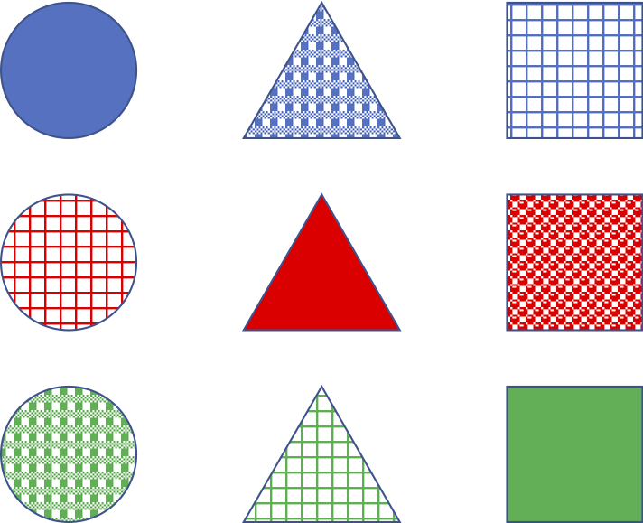

# 特徴量エンジニアリング：特徴ベクトル、数値データに対する前処理
- 参考
  - [機械学習のための特徴量エンジニアリング――その原理とPythonによる実践](https://www.oreilly.co.jp/books/9784873118680/)
  - [5.3. Preprocessing data](https://scikit-learn.org/stable/modules/preprocessing.html)
- ＜目次＞
  - <a href="#goal">達成目標</a>
  - <a href="#what-is-feature">そもそも特徴ベクトル（データ）とは何か</a>
  - <a href="#numerical">数値データ</a>
  - <a href="#report2">**課題レポート2：前処理してみよう**</a>　or 演習

## <a name="goal">達成目標</a>
- 同じデータセットであったとしても、タスク毎に適切な特徴量は異なることを理解する。
- 数値データに対する前処理の意義を理解する。
- 前処理のいくつかの手法を適用し、特徴空間の可視化による比較や、学習結果の比較から前処理の妥当性について検討することができる。

## <a name="what-is-feature">そもそも特徴ベクトル（データ）とは何か</a>
- Twitterが持つデータを全て利用できると仮定して検討してみよう。
  - 全利用者を「似たようなユーザ群、例えばゲームに興味があるといった趣味を主体としたクラスタ」に分けるには、どのような特徴が有効に機能するだろうか？
  - あるユーザの年齢層を推定するには、どのような特徴が有効に機能するだろうか？
- クラスタリングタスクの検討例
  - 下記9サンプルからなるデータセットを与えられたとき、どう特徴ベクトルを設計するとよいだろうか？
  - 
    - 「図形の形」でクラスタを作らせたい？
    - 「図形の色」？
    - 「着色パターン」？
- サマリ
  - **特徴ベクトル（feature vector）**とは、その名の通り特徴量で構成されたベクトルのこと。一つのサンプルは、N次元ベクトル空間における1点として表されることになる。近い点は類似しているサンプルになっていることが理想的だが、「似ている」といっても多面的であり、特徴量の用意の仕方や、距離もしくは類似度の尺度等、はたまたデータセット自体に含まれるミス・ノイズ等、多様な要因により必ずしもその通りになるとは限らない。
  - 一般的には、生のデータは多様な情報が複雑に絡みあっており、そのままでは利用しづらいことが多い。そのため、解決したい問題を機械学習しやすいタスクとして設計し、そのタスクに有効に機能する**特徴量（feature）**を用意してやる必要がある。**特徴量エンジニアリング（feature engineering）**とは、与えられたデータ、モデル、タスクに適した特徴量を作り上げるプロセスのこと。
    - [Feature engineering](https://en.wikipedia.org/wiki/Feature_engineering)
      - Feature engineering is the process of using domain knowledge of the data to create features that make machine learning algorithms work.

## <a name="numerical">数値データ</a>
- カウントデータ
  - Twitterにおける1ユーザの、1日あたりの投稿数やlike数。もしくはfollowerの多いユーザ数等、日常には様々な「カウントデータ」が存在する。カウントデータは、「実在する店舗における入客数」「在庫数に伴う販売上限」のように実世界における数である場合には上限が定まることもあるが、物理的な障壁がない場合、例えばYouTubeにおける動画再生数等のような場合には天井知らずである。このため、基本的には「カウントしたデータ」は上限がなく、外れ値（極端に大きい数値）が出現しやすいものとして扱うほうが良いことが多い。
- そもそも外れ値とは？
  - [Wikipedia: 外れ値](https://ja.wikipedia.org/wiki/外れ値)
  - 「統計学において、他の値から大きく外れた値」
  - 同ページにある外れ値検定の手法例についても参照。
- 外れ値があるとどういう問題がある？
  - 極端に大きな数値をそのまま扱うと、例えば、[線形回帰モデル](https://ja.wikipedia.org/wiki/線形回帰)で構築したモデルが外れ値に引きずられすぎてしまい、真のモデルからズレたモデルとなる可能性がある。
    - ここで「外れ値に引きずられる」とは、外れ値に対する誤差を縮めようとすることを指す。外れ値以外のサンプルに対しても同様に誤差が小さくなるように調整するが、サンプル数が少なかったり、それを上回る程の大きな数値の場合には外れ値の影響が強くなってしまう。
- どう対応すると良いのか？
  - 外れ値をデータセットから除外する。
    - 目的達成のために不要であれば、除外するのが最もシンプル。ただし、外れ値判定に注意。どのようなケースでも適している「銀の弾丸」は存在しないため、タスクに応じて検討することになる。
    - e.g., 動画再生数100回未満はあまりにも少ないので、無視しよう（データセットから除外しよう）。
  - 特徴空間、もしくは特徴ベクトル空間を調整（別空間に写像）する。
    - [Importance of Feature Scaling](https://scikit-learn.org/stable/auto_examples/preprocessing/plot_scaling_importance.html#sphx-glr-auto-examples-preprocessing-plot-scaling-importance-py)
    - 特徴量のスケール調整（feature scaling）とも呼ばれる。
- **数値データに対する前処理コード例**
  - [preprocess_numerical.ipynb](./preprocess_numerical.ipynb)

## <a name="report2">**課題レポート2：前処理してみよう**</a>　or 演習
- 課題レポート1で取り上げたデータセットについて、以下のことに取り組め。
  - Level 1. [preprocess_numerical.ipynb](./preprocess_numerical.ipynb)を参考に、何か一つ以上の特徴に対して前処理を施せ。なお、選択理由についても検討すること。
    - 例えば、2値化（binarization）を選んだのであれば、その理由は何故か？
  - Level 2. 適用前と適用後の値がどのように変わっているか、確認しやすいように可視化せよ。可視化の手法は問わない。
  - Level 3. 前処理後のデータを用い、分類タスクを実行せよ。課題レポート1の結果（前処理なしでの結果）と比較し、考察せよ。
    - 前処理後のデータを用いる際には、前処理した特徴を置き換える形で利用することを想定しているが、何か理由があって「前処理前のデータとまえしょり後のデータを同時に特徴量として扱いたい」のであれば、その理由を述べた上で使おう。
