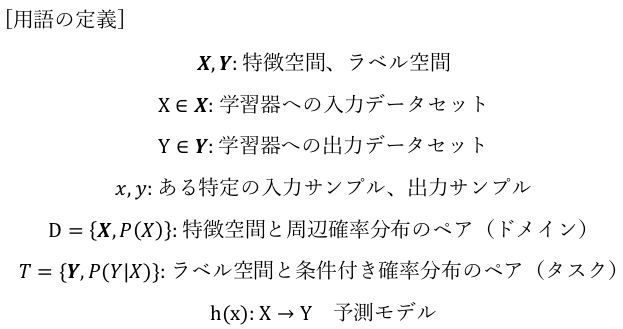

# 特徴量エンジニアリング：テキストデータに対する特徴量設計3（転移学習外観）
- 参考文献
  - [Tutorial on Domain Adaptation and Transfer Learning](https://tommasit.wixsite.com/datl14tutorial/materials), Tutrian on ECCV 2014
  - [A Gentle Introduction to Transfer Learning for Deep Learning](https://machinelearningmastery.com/transfer-learning-for-deep-learning/)
  - [TRANSFER LEARNING FOR COMPUTER VISION TUTORIAL](https://pytorch.org/tutorials/beginner/transfer_learning_tutorial.html)
  - [The State of Transfer Learning in NLP](https://ruder.io/state-of-transfer-learning-in-nlp/)
- ＜目次＞
  - <a href="#intro">背景と定義</a>
  - <a href="#application">実応用例</a>
  - <a href="#discussion">討論</a>

## <a name="intro">背景と定義</a>
- 問題意識
  - 何度もゼロ（ランダムな初期状態）からパラメータを求めるのはだるいし、計算リソースの無駄が大きい。学習済みモデルを再利用することで、より効率よく追加学習なりできないか？
- 定義
  - [Wikipedia: Transfer learning](https://en.wikipedia.org/wiki/Transfer_learning)
    - "Transfer learning (TL) is a research problem in machine learning that focuses on storing knowledge gained while solving one problem and applying it to a different but related problem.[1] For example, knowledge gained while learning to recognize cars could apply when trying to recognize trucks."
- 転移学習の目指すアプローチ
  - 
  - 2種類のドメインとタスクに関する変数として、
    - 転移前（ソース）：Ds, Ts, hs
    - 転移後（ターゲット）：Dt, Tt, ht
  - がある状況を想定しよう。ここでDsとDt、TsとTtは互いに異なるものとする。
  - 通常の機械学習ではDsにおけるTsを実現するためのhs獲得を目指す。これに対し転移学習においては、「Ds, Tsの知識を用いて、DtにおけるTtを実現するためのht獲得を効率よく行う」ことを目指す。ここで、【Ds, Tsの知識】は学習済みモデル（hs）のことを指している。
- 関連
  - ドメイン適応（domain adaptation）
  - 
    - [Wikipedia: Domain adaptaion](https://en.wikipedia.org/wiki/Domain_adaptation)より引用。
- 特徴（理想状態）
  - 
    - [A Gentle Introduction to Transfer Learning for Deep Learning](https://machinelearningmastery.com/transfer-learning-for-deep-learning/)より引用。
  - 転移学習し始めた学習開始時点におけるパフォーマンスは、通常の単独の機械学習と比べると良くなる傾向にある。
  - 学習開始時点だけではなく、その後の学習もよりスムーズに改善しやすい傾向にある。
  - 最終的にも、単独の機械学習だけで学習し続けた場合よりもより良いパフォーマンスを発揮する傾向にある。

## <a name="application">実応用例</a>
### 画像処理での例
- [TRANSFER LEARNING FOR COMPUTER VISION TUTORIAL](https://pytorch.org/tutorials/beginner/transfer_learning_tutorial.html)
  - PyTorchの公式チュートリアル。コード付き。ImageNetで学習済みのResNet18を用いて、100枚程度の小数サンプルしか用意していないアリとハチの画像を分類する追加学習をする例。ResNet18の層は追加学習時には重みを変更しないよう固定してしまい、追加した層でのみ新たな学習をする。

### 自然言語処理での例
- [BERT](https://github.com/google-research/bert)
  - Masked LM, Next Sentence Predictionという2つのタスクで事前学習しておく。そこで得られたモデルを利用し、本当にやりたいタスクに適用。同じモデルで異なる2種類のタスクを学習することは、考えようによっては「どちらか片方だけに特化したモデル」になったり、「どちらにも不十分なモデル」になりそうであったり、何かしらデメリットが大きそうだ。しかし大前提として、言語モデルを構築するのに100次元とか200次元とかの密ベクトル空間は本当に必要十分なサイズかというと、実はそうではない（無駄が大きい）ということが一般的に言われています。
    - 蛇足：一方で、どのぐらいのサイズが必要なのか、どこが無駄なのかは分かっていない。
      - 参考：[人間が深層学習のAIを理解できないのには、理由がある](https://globe.asahi.com/article/12872410)
  - 同じサイズの空間内に、同じ事象を表現する力が多数備わっているとでも言えば良いでしょうか。あるタスクに対する局所解が多数存在する空間をイメージしてください。初期値の違いやハイパーパラメータの僅かな違いで収束する先が異なりますが、モデル全体としての表現力は似たりよったりという状況です。この状況は、 **「ある特定タスクに対して似たりよったりの表現力を持つモデル」** になっています。特定タスクに特化した学習を進行しているだけであり、それ以上でもそれ以下でもない特化モデルを獲得しようとしています。特化モデルとは、他のタスクは考慮していないという意味での特化です。特化した分だけそのタスクに対しては能力は秀でているかもしれませんが、柔軟性が低く、他には適用できない硬すぎるモデルになっています。
  - 特化モデルに対し、BERTでは「言語モデルを必要とする異なる2種類のタスク」を同じモデルで学習している（できるような工夫も施している）点に特徴があります。異なるタスクですが、どちらでも言語的な理解を必要としているため、各々独立して学習させた場合には、以下のようなモデルを獲得できるでしょう。
    - タスク1だけで学習したモデルには、そのモデルで学べる理解がある程度含まれているはず。
    - タスク2だけで学習したモデルには、そのモデルで学べる理解がある程度含まれているはず。
  - BERTでは「特化したモデルが保有する特化した理解」の汎用化を目指して、2つのタスクを事前学習しています。言い換えると、2つのタスクをうまく説明できるような言語モデルを学習するように強制した状況（制約のある状況）で学習するように、追い込んでいます。2つのタスクをうまく説明できるのであれば、その分だけ特化モデルよりは汎用性が高いモデルを得られたと解釈することができるでしょう。このことを **「general language presentation」** と呼んでおり、その獲得のための手法が切磋琢磨されています。
- シンプルな転移学習例
  - 他の大規模コーパスからword2vec, fastText, BERT等でモデル構築（事前学習）するか、もしくは学習済みモデルを採用する。ここでの事前学習とは、大規模コーパスから構築した言語モデルを指す。
  - 学習済みモデルを用いて、別タスク向けのデータセットを構築し、学習（ファインチューニング）する。
- コード例
  - [簡易版転移学習の例](./simple_tranfer_learning.ipynb)
    - ソースが異なり、タスクも異なる、unsupervised transfer learningの例。
    - ここでは事前学習の際に自前でコーパス用意することも想定した例ということで swwiki-latest-pages-articles.xml.bz2 をわざわざローカルで学習していますが、動作確認するぐらいなら gensim, fastText, BERT等は学習済みモデルも公開しているので、そちらを使う方が楽です。
  - 別例1：[Transfer Learning for NLP: Sentiment Analysis on Amazon Reviews](https://github.com/feedly/ml-demos/blob/master/source/TransferLearningNLP.ipynb)
    - アマゾンのレビュー評価付きテキストデータで、学習用300万サンプル、テスト用65万サンプル。事前学習なしでもそれなりに取り組めそうな規模です。
  - 別例2：[BERT Tutorial on Colaboratory](https://colab.research.google.com/drive/1ywsvwO6thOVOrfagjjfuxEf6xVRxbUNO)
    - Colaboratory想定のため、環境構築はとっても楽。
    - ちなみに、BERTの事前学習自体に要する計算リソースはと〜〜〜〜〜っても高いです。公式曰く "Pre-training is fairly expensive (four days on 4 to 16 Cloud TPUs)"。

## <a name="discussion">討論</a>
- Q1：BERTの事前学習では、大規模なデータセットで2種類の異なるタスクを同一モデルでこなすように学習することで、より汎用性の高い言語モデルの獲得を目指している。ここでいう「汎用性の高い」状態とは、どのような状態だろうか？
- Q2：より大規模なデータセットと、より多数の異なるタスクを用意できれば、それで何も問題なく「良く」なるのだろうか？
  - 関連
    - https://twitter.com/kahajime/status/1199685614695661569
      - "AIの「分析」が「差別」を固定化する危険性については、アメリカではかなり議論されています。"
      - "たとえば、イギリスの警察では、再犯を犯す可能性の程度を予測するアルゴリズムが使用されていますが、[貧困地域に居住する者がより不利に判断されるという結果が生じている](https://www.wired.co.uk/article/police-ai-uk-durham-hart-checkpoint-algorithm-edit)、と問題となりました。"
    - [アップルのクレジットカードが「性差別」か　米当局が調査](https://www.bbc.com/japanese/50370810)
      - "「与信枠決定は顧客の信用度に基づいており、ジェンダーや人種、年齢、性的指向も、違法とされる基準も使っていない」"
