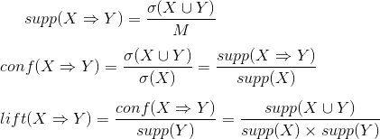

# 頻出パターン・マイニング（Frequent Pattern Mining）
- 参考資料
  - [頻出パターンマイニング](http://www.kamishima.net/archive/freqpat.pdf)
  - [頻出パターン発見アルゴリズム入門 -アイテム集合からグラフまで-](http://research.nii.ac.jp/~uno/papers/0806AIlecture.pdf)
  - [データからの知識発見](https://www.amazon.co.jp/dp/459531373X), 9章
  - [頻出パターンマイニング](http://ibisforest.org/index.php?頻出パターンマイニング) by 朱鷺の杜Wiki
- 目次
  - <a href="#intro">頻出パターンとは</a>
  - <a href="#example">典型的な例</a>
  - <a href="#howto">アソシエーション分析の考え方</a>
  - <a href="#apriori">Apriori アルゴリズムと、事例</a>

## <a name="intro">頻出パターンとは</a>
- [Wikipedia: 頻出パターン抽出](https://ja.wikipedia.org/wiki/データマイニング#頻出パターン抽出)
  - "データ集合の中から，**高頻度で発生する特徴的なパターン** を見つける。"
- 特徴的パターンの代表例
  - 頻出パターン抽出
    - 頻出する部分系列を列挙したり、対象系列を探索したりする。部分系列は部分集合を指すこともあるが、ここでは「系列」を含むことが多い。すなわち、ただの集合としてのマッチングではなく、一定の順序を伴う部分集合であることが多い。
  - 相関ルール抽出
    - データベースに蓄積された大量のデータから、頻繁に同時に生起する事象同士を相関の強い事象の関係、すなわち相関ルールとして抽出する技術。相関係数等のように関係だけを考慮するのではなく、因果関係を考慮することでどちらがどちらに影響しているかも考慮する。POSやEコマースの取引ログに含まれる購買履歴を利用したバスケット解析が著名である。
      - 例1：スーパーでビデオを買った人のうちガムテープを買う人が多い → 両者を同じ場所に置く。
      - 例2：本Aを買う人は、後に本Bを買うことが多い → 本Aの購入者に本Bを薦めるダイレクトメールを送る。
- [Wikipedia: Frequent pattern discovery](https://en.wikipedia.org/wiki/Frequent_pattern_discovery)
  - "Frequent pattern discovery (FP discovery, FP mining, or Frequent itemset mining) as part of knowledge discovery in databases / Massive Online Analysis, and data mining describes the task of **finding the most frequent and relevant patterns** in large datasets.[1][2] The concept was first introduced for mining transaction databases.[3] Frequent patterns are defined as subsets (itemsets, subsequences, or substructures) that appear in a data set with frequency no less than a user-specified or auto-determined threshold.[2][4]"

## <a name="example">典型的な例</a>
- POSデータ（Point Of Sales, 販売時点データ）として、[このようなデータ（pos1.tsv）](./pos1.tsv)が蓄積されているとする。
  - 各行は、一度に同時に購入された品物集合を表しており、これを **トランザクション** と呼ぶ。各トランザクションは購入した品物の集合であり、「Aを購入した」「Bを購入した」という出来事を **事象** と呼ぶ。
  - 同じ品物集合が出現したとしても識別できるように、トランザクション毎にユニークなIDを付与している。本来は商品集合に加え、日時、顧客属性が付与されることが多い。顧客属性としては性別や年代程度に留まることが多いが、電子マネーのような情報が利用されるケースもある。
  - [アソシエーション分析](https://en.wikipedia.org/wiki/Association_rule_learning)では、このデータセットから【頻出するアイテムの組み合わせの規則】を漏れなく抽出し、その中から興味深い結果を探し出すことを目的とする。

## <a name="howto">アソシエーション分析の考え方</a>
- トランザクションデータを活用するために、商品間の関係について分析を行うために事象X, Yを想定する。このとき【``X→Y``】は「事象Xを購入した人は、事象Yを購入している」ことを表しており、これを **相関ルール（アソシエーションルール, association rule）** と呼ぶことにする。なお、XとYは互いに同じものを含まない。
  - 本来は、全組み合わせについて洗い出した上で、何らかの条件（評価指標）を用いてルールを絞り込みたい。
  - 
- 支持度（support）
  - ``σ(X)``：集合Xを含むトランザクション数。
  - ``M``：トランザクション総数。
  - データセットにおいて、XとYが同時に起こる確率。
- 確信度（confidence）
  - Xが起こった前提でBが起こる確率。
- リフト（lift）
  - 確信度をYが起こる確率で割ったもの。Yが単独で出現割合と比べて、XとYが同時に出現する割合がどれだけかを表す。

## <a name="apriori">Apriori アルゴリズムと、事例</a>
- [頻出パターンマイニング](http://www.kamishima.net/archive/freqpat.pdf) by 神嶌先生
