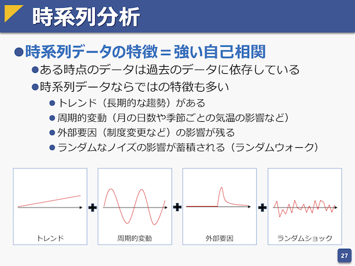

# 時系列データ分析
- 参考資料
  - [確率統計－機械学習その前に v2.0, pp.27](https://www.slideshare.net/HidekatsuIzuno/v20-91382793)
  - [Rで計量時系列分析：AR, MA, ARMA, ARIMAモデル, 予測](https://tjo.hatenablog.com/entry/2013/07/12/184704)
    - [一般的な時系列のモデリング＆予測に、機械学習系の手法よりも古典的な計量時系列分析の方が向いている理由を考えてみた（追記あり）](https://tjo.hatenablog.com/entry/2019/09/18/190000)
      > 機械学習系の手法は定常過程を前提としていて、非定常過程に弱い
  - [SARIMAで時系列データの分析（PV数の予測）](https://www.kumilog.net/entry/sarima-pv)
  - [Pythonによる時系列分析の基礎](https://logics-of-blue.com/python-time-series-analysis/)
  - [Pythonで時系列分析の練習（1）モモノキ＆ナノネと一緒に時系列分析を学ぼう](https://momonoki2017.blogspot.com/2018/02/python1.html)
  - [PythonでのARIMAモデルを使った時系列データの予測の基礎[前編]](https://blog.brains-tech.co.jp/entry/arima-tutorial-1)
  - [Kaggleで勝つデータ分析の技術](https://gihyo.jp/book/2019/978-4-297-10843-4)
  - [未来を予測するビッグデータの解析手法と「SARIMAモデル」](https://deepage.net/bigdata/2016/10/22/bigdata-analytics.html)
- ＜目次＞
  - <a href="#intro">背景と目的</a>
  - <a href="#dataset">データセット例</a>
  - <a href="#terms">重要な用語や概念</a>
  - <a href="#example">例題</a>

## <a name="intro">背景と目的</a>
- 大前提
  - 時々刻々と蓄積される時系列データがあります。例えば株価や、ある地点における気温や湿度、より身近なところでは課金UU（課金したユニークユーザ数）などなど。ランダム生成したものでないならば、その事象に関係が深い要因が何なのか、例えば流行であったり自然災害といった何かしらの外部要因を説明変数として用意することができれば、モデルとして定式化できるだろう。定式化できるということは、「過去のデータに基づいて、近未来もしくは中長期的な未来にどうなるか（伸びる/停滞/下落）」を推測できるはず。
  - ある時刻における観測データは、一つしかない。（一度しか観測できない）
- 問題意識
  - 一方で、（これまでに紹介した）代表的な機械学習モデルで扱うためには、モデルへの入力を特徴ベクトルとして表現することが必要。これに対し、時々刻々と蓄積される時系列データはどのように表現したら良いだろうか。もしくは別のアプローチはないのだろうか。
- 直感的に思いつく例
  - そのまま時系列データを並べる。
    - e.g., 時刻t-1のデータ、時刻t-2のデータ、、、時刻t-kのデータを特徴ベクトルとする。
    - この場合、モデルによっては「前後の並び」を考慮できておらず、結果として系列としての特徴を盛り込むことができていない。特徴ベクトルにおける特徴がどのように並んでいるかはあまり考慮されないケースが多い（モデル次第）ため、結果としてまともなモデルを構築できない（適切なパラメータを探しきれない）可能性が高い。
  - 差分を特徴量とする。
    - e.g., 1個前との差分。各時刻における差分を特徴量として並べて、特徴ベクトルとする。
    - この場合、ある時刻を出発とした差分は観測できており、実際これでもある程度のモデルを構築することは可能。しかし、機械学習の場合は中長期的な影響（e.g., 1週間のトレンド、1年周期のトレンド、、）を考慮することが困難。
- 時系列データの特徴
  - by [確率統計－機械学習その前に v2.0, pp.27](https://www.slideshare.net/HidekatsuIzuno/v20-91382793)
    - 
- 考え方と目的
  - by [Rで計量時系列分析：はじめに覚えておきたいこと](https://tjo.hatenablog.com/entry/2013/07/04/190139)
    > 隠れた内部構造を含めて「時系列データが持っている多様な特徴を記述できるモデルを構築する」こと（沖本本p.4）、「変数間の動学的関係を明らかにする」こと（沖本本p.4：要するに異なる時系列同士で時間変化していく相関・因果・依存関係などを導き出すこと）、そして「それらの時系列モデルに基づいて様々な経済学的・ビジネス的な仮説や理論を検証する」ことこそが、時系列分析の目的だと言って良いでしょう。

## <a name="dataset">データセット例</a>
- [AirPassengers](https://stat.ethz.ch/R-manual/R-devel/library/datasets/html/AirPassengers.html)
  > The classic Box & Jenkins airline data. Monthly totals of international airline passengers, 1949 to 1960.
- [Recruit Restaurant Visitor Forecasting](https://www.kaggle.com/c/recruit-restaurant-visitor-forecasting/data)
  > One common predicament is that restaurants need to know how many customers to expect each day to effectively purchase ingredients and schedule staff members. This forecast isn't easy to make because many unpredictable factors affect restaurant attendance, like weather and local competition. It's even harder for newer restaurants with little historical data.
- [DJIA 30 Stock Time Series](https://www.kaggle.com/szrlee/stock-time-series-20050101-to-20171231)
  > Stock market data can be interesting to analyze and as a further incentive, strong predictive models can have large financial payoff. The amount of financial data on the web is seemingly endless. A large and well structured dataset on a wide array of companies can be hard to come by. Here provided a dataset with historical stock prices (last 12 years) for 29 of 30 DJIA companies (excluding 'V' because it does not have the whole 12 years data).

## <a name="terms">重要な用語や概念</a>
- 自己共分散（Auto-covariance）
  - "In probability theory and statistics, given a stochastic process, the autocovariance is a function that gives **the covariance of the process with itself at pairs of time points**. Autocovariance is closely related to the autocorrelation of the process in question." by [Wikipedia: Autocovariance](https://en.wikipedia.org/wiki/Autocovariance)
  - 時刻をずらした自身の過程との共分散（＝時刻をずらした際の傾向の類似性）。
- 自己相関（Auto-correlation）
  - "Autocorrelation, also known as serial correlation, is **the correlation of a signal with a delayed copy of itself as a function of delay**. Informally, it is the similarity between observations as a function of the time lag between them. " by [Wikipedia: Autocorrelation](https://en.wikipedia.org/wiki/Autocorrelation)
  - 自己相関＝過去の値とどれぐらい似ているか？
  - 偏自己相関＝指定ラグまでの要因とどれぐらい似ているか？（e.g., 1日前の値との相関をみるときに、2日前以前の影響を無視したい）
- 自己回帰モデル（Auto-regressive model）
  - "The autoregressive model specifies that **the output variable depends linearly on its own previous values and on a stochastic term (an imperfectly predictable term)**; thus the model is in the form of a stochastic difference equation." by [Wikipedia: Autoregression model](https://en.wikipedia.org/wiki/Autoregressive_model)
    - 単純化した例：``y_{t} = a * y_{t-1} b``
  - VAR（ベクトルAR）
    - 時系列の多変数を同時に分析する場合に使うモデル。
- 移動平均モデル（Moving Average）
  - [Wikipedia: 移動平均モデル](https://ja.wikipedia.org/wiki/移動平均)
    - 移動平均は、**時系列データ（より一般的には時系列に限らず系列データ）を平滑化する手法**である。音声や画像等のデジタル信号処理に留まらず、金融（特にテクニカル分析）分野、気象、水象を含む計測分野等、広い技術分野で使われる。有限インパルス応答に対するローパスフィルタ（デジタルフィルタ）の一種であり、分野によっては移動積分とも呼ばれる。
- ARIMA（Auto-regressive, Integrated and Moving Average）
  - 「直前の値に定常過程に従う何かの値を足すことで現在の値になる」時系列（e.g., 株価）には、それなりに効果が高い。
  - ただし、「直前の値」を対象としているため、それ以外の影響、例えば「1年前の値」といった季節性は考慮できない。
- SARIMAモデル（Seasonal Auto-regressive Integrated Moving Average）
  - [未来を予測するビッグデータの解析手法と「SARIMAモデル」](https://deepage.net/bigdata/2016/10/22/bigdata-analytics.html)

## <a name="example">例題</a>
- [AirPassengersの時系列分析](./ex-AR.ipynb)
