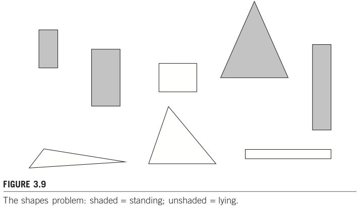
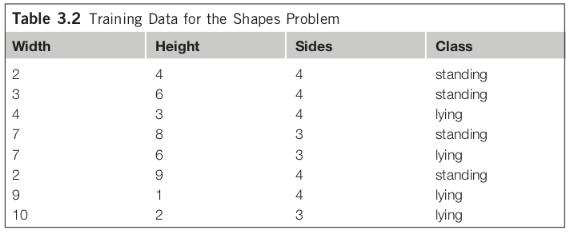

# Introduction to Data Mining / データマイニング入門

- ＜目次＞

## <a name="abst">概要</a>
- データの山を採掘することで「データの中に埋め込まれている(有用な)知識を発掘」する。
  - 具体的な例題は？
  - その場合における有用な知識とは？
  - どうやって発掘すると良い？
  - これまでの過程において何か問題になることはないだろうか？

## <a name="background">背景</a>
- データから有益な知識を発掘したいという問題意識は古くからあるが、コンピュータが広まる前はそもそもデータの蓄積自体が困難だったり、蓄積できるようになってきても十分な計算機パワーがなかった。例えば、2000年頃はまだスマートフォンもなく、個々人が動画を撮影してSNSで共有する、、、といったことはなく、そういう個人用途のデータはまだまだデータとして集まっていなかった。これに対し今では、様々なデータが蓄積され続け、そのスピードは増す一方である。
- [Wikipedia: data](https://en.wikipedia.org/wiki/Data)
  - ``Data is a set of values of subjects with respect to qualitative or quantitative variables.``
  - 現場における **データ（data）** は、質的も量的にも変数化されていなかったり、どこかに一箇所（DB等）にまとまっていないことも少なくない。整理されていないデータのことを **生データ（raw data）** と呼ぶことにしよう。授業では、基本的には「データ（既に質的もしくは量的に変数化されているもの）」を対象とする。
  - 知ってる知識が得られるだけでは嬉しくない。新しく、再利用可能な知識を得たい。 (useful new knowledge)
    - 再利用の形にもいろいろ。
- 別の言葉で言い換えると、、
  - 「殆どの人間が当たり前にできること」をコンピュータにさせたい。
    - 画像に写っているのは犬か猫か？
    - ある事件について報道している記事はどれか？
  - 「場合によっては専門家でも難しいタスク」をコンピュータにさせたい。
    - 新しい化学反応は無いだろうか？, [ロボットが機械学習で新しい化学反応を発見：機械学習で有機合成ロボットを制御して反応性を探索する研究](https://marvin.news/4303)
    - 放射線科医が行っていた医療画像からの読影をサポートできないか？, [画像診断と機械学習そしてDeep Learning ReconstructionによるMRI画像にあたえるインパクト](https://www.innervision.co.jp/sp/ad/suite/canonmedical/seminarreport/garon2018_mri)

## <a name="target">授業で触れる範囲、触れない範囲</a>
- 授業で振れる範囲
  - 知識発掘時によくある問題。
    - 各種データ（数値・カテゴリ・文章）の取り扱い。
      - （余裕があれば：グラフ、時系列データなども）
    - 不均衡データ。
    - 文章特有の問題。
      - 単語、新語・未知語、概念的上位下位関係、代名詞、、、
  - いくつかの代表的なマイニング技術（機械学習、統計的手法）。
  - これらの実装例、事例紹介。
    - 「ライブラリの使い方」 vs 「その裏側で動いている仕組み」
    - 事例紹介
      - 論文における主張の妥当さも重要だが、それ以上にアプローチの仕方が面白そうに感じるもの（當間主観）を紹介。
  - [No Free Lunch](https://ja.wikipedia.org/wiki/ノーフリーランチ定理)
    - 授業でこの内容に触れるというよりは、これを前提として様々な考え方・アプローチを紹介する。
- 関連分野との位置づけ
  - 人工知能（の一部に機械学習）：知能らしさに対する工学的アプローチ。どちらかというと「らしさを実現すること」に重きを置くケースが多い。
    - 機械学習の立場：小さなパターンなら手動で書くこともできるが、例えば「画像処理における猫らしさ」をパターンとして書き下すのは極めて困難。そのようなパターン生成を自動化しようと試みているが、そのパターンは人間の基準と同一とは限らない。
  - 統計学：データ分析アプローチ。どちらかというと「何故こうなるのかを説明すること」に重きを置くケースが多い。
  - [OR（Operations Resarch）](https://ja.wikipedia.org/wiki/オペレーションズ・リサーチ)：最適化、意思決定理論。ある工場において、どのスケジュールで素材を手配し、組み立て、配送するのが最も効率良くなるだろうか、というように「分析対象をシステムとして定式化し、その最適解や近似解を効率良く求める」ことに重きを置く。
  - データマイニングでは「これらを道具としてバランス良く使い、有用な知識発掘をする」ことを目指す。
- 授業で触れない箇所
  - 知能情報コースで提供している他科目の内容
    - [データサイエンス](https://ie.u-ryukyu.ac.jp/syllabus/2019/early/617008001.html)の基礎
    - [人工知能](https://ie.u-ryukyu.ac.jp/syllabus/2018/late/617013002.html)の基礎
    - [機械学習](https://ie.u-ryukyu.ac.jp/syllabus/2019/early/617027001.html)の基礎
      - 「機械学習」については選択科目でもあるため、概要ぐらいは触れる予定。ただし、本授業だけでは十分な時間が取れない（重複を避ける）ため、注意すること。
      - e.g., モデル、回帰・分類・クラスタリング、特徴ベクトル、学習データ、テストデータ、交差検証、LOO、混同行列、、、
  - 下記もほぼ同様の理由で、本授業では扱いません。
    - 分散システム
    - 並列計算
    - データベース
    - リアルタイム処理
    - 高速化等実用的な実装

## <a name="examples">ケーススタディ外観</a>
### <a name="process">0. 大まかな流れ</a>
- 生データ -> 特徴量表現 -> 処理
  - 生データ：実世界にある何かしら
  - 特徴量：生データを実数値ベクトル等、機械が処理しやすい形式に落とし込んだもの
    - 観測値 vs 専門家等人手のかかる値
    - 簡単にわかるデータから、手間のかかるデータを得たい。
  - 機械学習：特徴量から概念への写像

### 1. 各種データの取り扱い：特徴量工学、データのサンプリング
#### 1-a. データを構成する特徴量の話
- タスク例: Shapes problem by p.76, [Data Mining: Practical Machine Learning Tools and Techniques, 3rd Edition](http://www.cs.waikato.ac.nz/ml/weka/book.html)
  - FIGURE 3.9 The shapes problem: shaded = standing; unshaded = lying.
    - 
    - 2クラスへ分類するタスク。
  - Table 3.2 Training Data for the Shapes Problem
    - 
    - width, height, sides の3属性。
  - このデータセットににおける頻出パターンマイニングの結果、例えば「if height >= 3.5 then standing」が得られるかもしれない。これは有益なパターンだろうか？
    - このような「嬉しくないルール」を獲得しがちな理由は、多くの機械学習は属性間の関係を考慮しないから。考慮することも可能だが、高コストのため避けることが多い。最初から独立していることを想定しているモデルもある（e.g., 線形回帰モデル）。
      - 属性数Nのデータセットにおいて、全属性間の2要素間関係を考慮するとどれだけのコストが必要になるだろうか？（それを3要素、4要素、、、と増やしていった場合、どこまで増えるだろうか？それは現実的だろうか？）
      - そこを考慮する工夫をしているモデルもある。（e.g., CNN）
    - 「属性間の関係を考慮しない」前提で、改善する余地は無いだろうか？
      - **特徴量工学（feature engineering）**
      - 画像分類タスク、文字認識タスク等の、ある特定のタスクに特化して機能する特徴量を検討し、利用することを目指す。本授業では、タスク特化の特徴量も扱うが、汎用性の高い扱い方（＝各種データの取り扱い）についても取り上げる。
      - なお教員の興味の問題で、タスク特化特徴量については自然言語の例示が多く、静止画・音声・動画像あたりのデータはほとんど取り扱わない予定である。
- サマリ
  - 用意したデータが何なのか理解せず、獲得したいルールを想定せず、どのようなモデルを利用しているかを把握せずに機械学習等でパターンを抽出しようとすると、類似状況に直面していることに気づかないことがある。不適切なパターン（ルール）を利用しても効果的な結果は得られないため、これらの理解が大切。
- クイズ
  - ここで出てきた用語のうち、以下に示す用語を自分なりに説明してみよ。（授業「機械学習」でやる内容）
    - 頻出パターン
    - 分類タスク
    - クラス
    - 属性
    - 特徴量
    - モデル
    - パターン
    - 機械学習

#### 1-b. データセットを構成するデータの話
- 不均衡データ
  - 「欲しい事例は、そうでない事例と比べると集めるコストが高くなりがち」のため、結果的にデータセットにおけるデータ数は偏りが大きくなるであることが多い。
    - 「画像に写っているのは動物である」 vs 「動物ではない」
- タスク例
  - [うつと関連性が低いとされている生活習慣等からのうつ傾向予測](https://www.jstage.jst.go.jp/article/pjsai/JSAI2019/0/JSAI2019_2P5J201/_article/-char/ja/)
    - 「（中略）そこで本稿では、まず、どの生活習慣、気質、体質がうつ状態と関連していないとみなされているかを明らかにし、それらの生活習慣等の中で、実際には関係しているものを予測するモデルを利用し特定することを目的とした。この時、実際のデータに近いうつ傾向高い人が少ない不均衡なデータで試みた。」
    - 表1: L2正則化ロジスティック回帰の混同行列
      - ![表1: L2正則化ロジスティック回帰の混同行列]
  - [深層学習抽出特徴量から生成した擬似特徴量を用いた不均衡データ多クラス画像分類](https://www.jstage.jst.go.jp/article/pjsai/JSAI2018/0/JSAI2018_2A104/_article/-char/ja/)
    - 「データの中に少量しかないクラスがあると、そのクラスの識別率が極端に低下してしまう場合がある。そのようなデータは現実のデータ分析では頻繁に遭遇する。（中略）」
  - 何が問題だろうか？
- サマリ
  - 不均衡データの場合、マイニング手法が優れていたとしても適切なパターンを得ることは困難になりがちである。不均衡データ問題への代表的な解決方法を学ぼう。
- クイズ
  - ここで出てきた用語のうち、以下に示す用語を自分なりに説明してみよ。（授業「機械学習」でやってる場合、軽く流す程度にする予定）
    - 不均衡データ

### 2. 自然言語処理（半構造データの一例）
- タスク例
  - 記事分類: [自動記事分類技術を用いた「日経テレコンナビ型記事検索」　情報収集に気づきを提供する新スタイル](https://www.jstage.jst.go.jp/article/johokanri/57/12/57_900/_article/-char/ja/)
    - 「利用者が思いついたキーワードを起点として、検索された結果を複数の観点で自動的に分類し、利用者が求めている情報（検索結果）にたどり着くことができるようになっている。」
  - レビュー分析: [絵本レビューを情報源とする子どもの認知発達的反応の収集・類型化とそれに基づく絵本の分類](https://www.jstage.jst.go.jp/article/jsoft/30/3/30_581/_article/-char/ja/)
    - 「本論文で情報源とする絵本レビューサイトにおいては、実際に絵本の読み聞かせを行った養育者や保育者が、絵本の読み聞かせを行った際の様子や絵本への感想、絵本に対する子供の反応の有無やその反応の様子など、多岐多様な情報を記載している。」
  - 極性判定: [Twitterを対象とした評価極性判定システムの構築](https://www.jstage.jst.go.jp/article/pjsai/JSAI2013/0/JSAI2013_1F41in/_article/-char/ja/)
    - 「（中略）ある対象に関する評価を含むツイートを収集し、評価対象・属性・評価後の3つ組を抽出し、ツイートの評価極性を判定することによりその実現を試みる。」
  - クラスタリング: [テキストマイニングによる食レポ口コミからのユーザー嗜好モデリング](https://akita-pu.repo.nii.ac.jp/?action=pages_view_main&active_action=repository_view_main_item_detail&item_id=1015&item_no=1&page_id=13&block_id=21)
    - 「（中略）もし、和食と洋食で季節感を感じさせる単語が一致し、似たような分析結果が出れば、以前、和食の飲食店を利用したユーザーに同じ旬の食材を使った料理や似たような季節性の高い食べ物を提供する洋食の飲食店も提案することができるだろう。」
  - 固有名認識、関係抽出: [生命情報学が直面する大規模ゲノムデータ時代の課題 : 3.生命科学分野におけるテキストマイニング](https://ipsj.ixsq.nii.ac.jp/ej/?action=pages_view_main&active_action=repository_view_main_item_detail&item_id=67186&item_no=1&page_id=13&block_id=8)
    - 「多くの研究者がさまざまな実験を行い、その結果を次々と論文で発表しているため、得られた知見は主に構造化されていない自然言語の形で集積されてゆく。研究の進展や領域の細分化に伴い、論文が発表される頻度も高くなっている。このような状況において、特定の研究課題に関連する文献を効率的に見つけ出し、上記のような情報を取得してゲノム情報と紐付けた形でのデータベースを構築するためにテキストマイニング技術を利用することが多くなっている。ただし対象となるデータの規模と種類は広く、1つの研究室レベルですべてに対応できないため、テキストマイニング技術を用いたシステムの公開や必要なリソースの共有が行われている。本稿では生命科学分野におけるテキスト処理技術の現状、BioHackathon 2009 で議論された事項を踏まえて解説する。」
- 非構造化データの一種
- 数値の場合
  - モデル化
    - 数値の範囲、出現頻度、ヒストグラム等の統計情報を求め、それらのデータに基づいた入出力を何らかの形で数式化して表現することで事象を形作ろうとする。
    - 例: [Wikipedia:線形回帰](https://ja.wikipedia.org/wiki/線形回帰)
  - 近さ（距離）
    - ある2サンプルについて距離を定義するには、[3つの性質](https://ja.wikipedia.org/wiki/距離)を満足する距離関数を設計する必要がある。
    - よくある「あるx,yで表現した2次元空間」における距離は、ユークリッド距離。他にも[マンハッタン距離](https://ja.wikipedia.org/wiki/マンハッタン距離)等、目的に応じて様々な距離関数が提案されている。
      - この距離が短いほど、その2点に位置するサンプルは距離的に近いことを意味する（ように設計する）。
      - ある目的に合致するよう上手く設計された空間内では、「類似したサンプル集団」が近くに配置され、そうでないサンプルは離れて配置されるため、「（設計した意図における）近さを指標としたパターン」を抽出しやすくなる。
- 文章（テキストデータ）の場合
  - そもそも対象が数値ではない。
    - 文字（character）単位でカウントする？
    - 単語（word）単位でカウントする？
      - 日本語のように、一部の言語ではそもそも「単語」という定義自体も不明瞭。
  - そもそもどのように文章データを扱えばよいだろうか？
    - **自然言語処理**
  - 取り組み例（今回はキーワードのみ紹介）
    - one-hot表現
      - 形態素解析、（構文解析）
    - 分散表現
      - word2vec
        - CBOW, Skip-gram
          - ボキャブラリーに伴う新語問題
      - fastText
        - 新語対策：subword
          - 何にでも適しているかは別問題
      - Transformer
        - 前身
          - DCGAN
            - lweakyReLU
            - Jensen-Shanonダイバージェンス
              - BCE, Binary Cross Entropy
- サマリ
  - 文章を処理対象とする場合、何らかの形で処理しやすいデータへと変換した上で取り扱うことが一般的である。その代表的な技術について学ぼう。
- クイズ
  - ここで出てきた用語のうち、以下に示す用語を自分なりに説明してみよ。
    - 半構造データ（<-> 構造化データ）
    - 記事分類
    - レビュー分析
    - 極性判定
    - クラスタリング
    - one-hot表現
    - 分散表現

### 3. グラフ/ネットワーク
- グラフとは
  - ノード集合、辺集合があり、辺がノードの対で表現された構造をグラフと呼ぶ。
  - 有向グラフ、無向グラフ、部分グラフ、木、、
- タスク例
  - コミュニティ抽出: [大規模グラフ構造データからのコミュニティ抽出と重要度計算：高速化への取り組みと応用](https://jsai.ixsq.nii.ac.jp/ej/?action=repository_action_common_download&item_id=1689&item_no=1&attribute_id=22&file_no=1)
    - 「SNSなどのソーシャルメディアの爆発的な普及に伴い、ビッグデータの持つデータ構造は、従来の単純な表構造から、Web上あるいは実世界のどの場所で利用者が何を参照したか、などの、人・物・場所といった多様な情報のつながりを表現するグラフ構造へとシフトしてきている。（中略）twitterなどのマイクロブログにおけるメッセージのやり取り関係をグラフ構造で表現すれば、情報の伝播、拡散の経路や影響力の高さなどを把握できる。ほかにも、企業間の取引関係をグラフ構造として分析し、産業構造の把握や地域の活性化に活かそうとする取り組みも始まっている。」
  - 生物学的ネットワーク: [ゲノム解析のアルゴリズム](http://research.nii.ac.jp/~uno/MP2/MP2_14genome.pptx)
    - 系統樹・遺伝子発見・類似度計算・部分列のマッチ・固有部分列の発見等のゲノム問題に対し、機械学習を用いた遺伝子発見、最短路を用いたゲノムの類似度計算等が行われている。
  - 社会ネットワーク: [社会ネットワークにおける中心製の定量的な頑健性評価法の提案](https://ci.nii.ac.jp/naid/170000088318)
    - 「（中略）特に、友人関係などの社会ネットワークはプライバシーなどの問題から全体構造を性格には把握できない。社会調査などから得られるエゴセントリック情報（友人数など）をもとに全体構造を推定し、構造分析や重要ノードを抽出することは重要な研究課題である。」
  - 情報伝搬: [東日本大震災時のTwitterにおける情報伝播ネットワーク](https://eprints.lib.hokudai.ac.jp/dspace/handle/2115/51739)
    - 「東日本大震災発生日の2011年3月11日と震災後1週間経過後の3月18日、および、その2日後の20日のデータから生成されるリツイートネットワークについて、そのネットワークの特徴量を調査した結果について紹介する。」
  - 汎用的な多頻度抽出アルゴリズム: [多頻度グラフマイニング手法の一般化](https://www.jstage.jst.go.jp/article/tjsai/19/5/19_5_368/_article/-char/ja/)
    - 「グラフデータの集合から特徴的なパターンを取り出す問題は、存在しうるパターンの数の膨大さとNP完全として知られる部分グラフ同型問題を含むので、非常に膨大な計算コストを有する。（中略）本稿では、特定のグラフパターンではなく、様々なグラフパターンを抽出するために、汎用で、効率良い手法を提案する。」
- サマリ
  - 表構造では表現困難なデータの一つにグラフがある。文章よりは構造化されているが、パターンの幅が多岐にわたるため有益知識の発掘は一筋縄ではいかない。ここでは、（時間の許す範囲で）いくつかの代表的な技術について学ぼう。
- クイズ
  - ここで出てきた用語のうち、以下に示す用語を自分なりに説明してみよ。
    - ノード、辺
    - コミュニティ
    - 系統樹
    - 類似度
    - 情報伝播

### 4. 時系列データ
- 時系列データとは
  - ゆるい定義では「タイムスタンプのついた値」。
  - 硬い定義では「時間とともに変化するデータやイベントを継続的に観測した系列。通常は観測する時間間隔は一定れた値」。
- タスク例
  - クラスタリング: [知識発見支援のための気象画像データベースの構築](https://ipsj.ixsq.nii.ac.jp/ej/?action=pages_view_main&active_action=repository_view_main_item_detail&item_id=17786&item_no=1&page_id=13&block_id=8)
    - 「医療画像や衛星画像、ビデオ画像、監視カメラなどの膨大な量の画像情報は数テラバイトにもなり、これらのデータを人手によって詳しく調べるのは手間がかかり現実的ではない。このように画像データベースにおけるデータマイニングは、巨大な画像データの中に存在している自明でない関係や、パターンなどを発見することを目的としており、科学的発見の部類に位置する。（中略）一つ一つは単なる画像データであるが、同画像のように時間的連続性を持ったデータであり、このような特徴を持つ膨大な画像に対してコンテンツベースの画像検索を行うには従来の画像処理技術では限界がある。そこで本研究ではコンテンツベースの画像検索にデータマイニングの手法を適用する。これによりデジタル画像からの気象情報を取り出し、画像データベースに変換して抽出したパターン情報の視覚化を行い、専門家による解析と科学的発見を支援する気象画像データベースの構築を行うことを目的としている。」
  - トレンド分析: [プロセス監視のための時系列データからの特徴抽出](https://www.jstage.jst.go.jp/article/kakoronbunshu1975/22/5/22_5_1103/_article/-char/ja/)
    - 「少人数化政策を背景に進められてきたプラントの自動化は、オペレータを単純作業から開放したが、それに変わって以上発見のための注意力や、原因究明のための推論、最適操作のための意思決定といった、深い知識と思考を必要とする作業が少数のオペレータに集中するようになってきた。」
    - 「本研究ではプラント監視の観点より、時系列データから作成した連続関数から、スパイク状変化やステップ状変化などの局所的特徴と全体的な傾向であるトレンドを同時に抽出する方法を提案する。」
  - 異常値検出: [異常値検出のアンサンブルによる軌跡データからの特異行動の発見](https://ipsj.ixsq.nii.ac.jp/ej/?action=pages_view_main&active_action=repository_view_main_item_detail&item_id=69424&item_no=1&page_id=13&block_id=8)
    - 「実環境で動作する自律ロボットの制御プログラムの設計は長時間のテストとその動作解析の繰り返しを伴う。その解析は設計者に大きな負担となっている。本論文では、ロボットの軌跡データから自動的に異常行動を検出することで設計者の負担を軽減する手法の開発を目指す。」
  - 類似シーケンス検索: [時系列データのためのストリームマイニング技術](https://ipsj.ixsq.nii.ac.jp/ej/?action=pages_view_main&active_action=repository_view_main_item_detail&item_id=65664&item_no=1&page_id=13&block_id=8)
    - 「時系列データについては、時系列解析、機械学習、知識発見、データベースなどの分野で取り組まれてきたが、従来の取り組みの多くは、蓄積された有限帳の時系列データの処理に注目してきた。近年、これまでの時系列処理とは異なり、データストリームを志向した時系列処理の研究が盛んになっており、データストリームマイニングと呼ばれている。これは、単にデータベースに蓄えられた大規模データを分析するのではなく、どんどん増え続けるデータの流れをリアルタイムに分析し、監視するための技術である。センサデータの分析処理、ネットワークの分析や監視、人や車のような移動物体の監視などへの応用が期待されている。」
- サマリ
  - 時系列データは数値化されているものの、グラフ同様に、パターンの幅が多岐にわたるため有益知識の発掘は一筋縄ではいかない。ここでは、（時間の許す範囲で）いくつかの代表的な技術について学ぼう。
- クイズ
  - ここで出てきた用語のうち、以下に示す用語を自分なりに説明してみよ。
    - クラスタリング
    - 気象情報
    - トレンド
    - スパイク状変化
    - ステップ状変化
    - 局所的特徴
    - 全体的な傾向
    - 異常値、異常行動
    - 類似シーケンス
    - データストリーム

## 予習
- 機械学習について概説している[An introduction to machine learning with scikit-learn](https://scikit-learn.org/stable/tutorial/basic/tutorial.html)の冒頭「Machine learning: the problem setting」から「Learning and predicting」あたりまで読み、自分なりに疑問点等気になる事柄を整理せよ。
  - 授業開始時に確認します。
